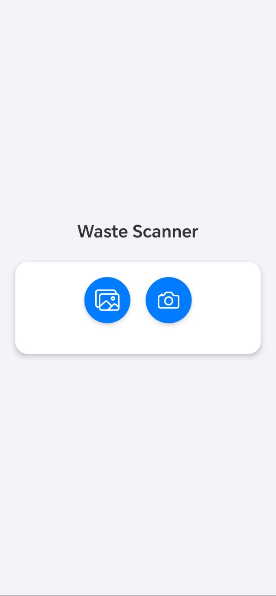
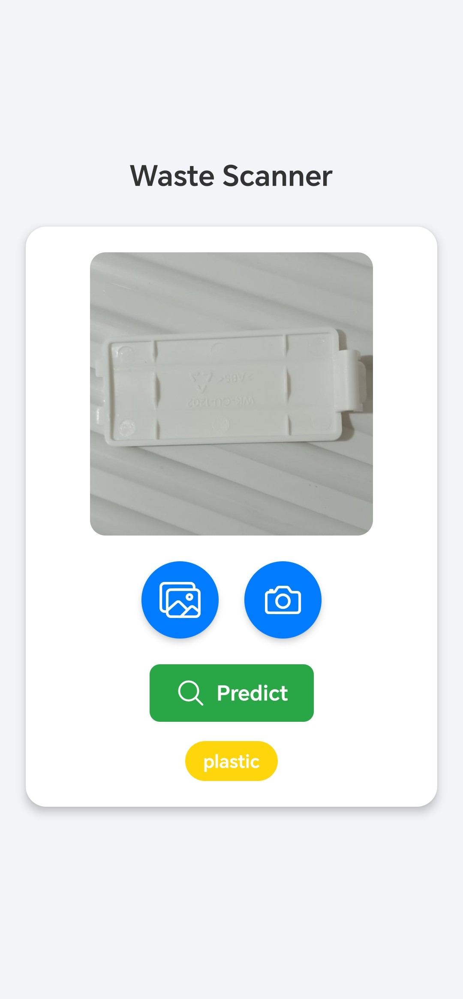
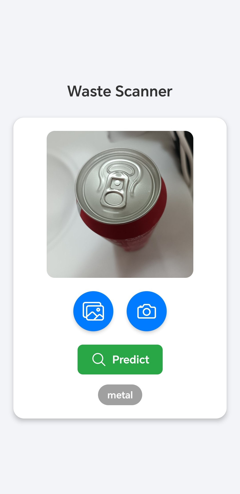
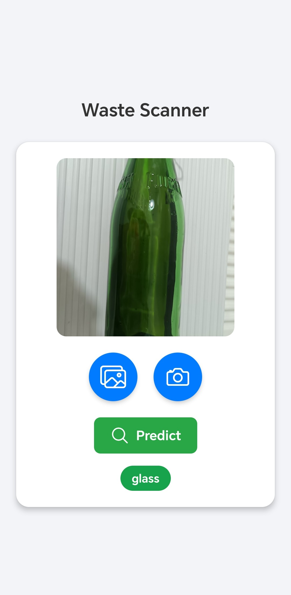

# Waste Scanner

##Description
**Waste Scanner** is a cross-platform app for the [Waste Classification Project](http://www.google.com). It consists in a simple front-end to let the user predicting the category of a waste from an image, using a Deep Learning model that runs on a server. Users can select an image using a file picker or take a photo of the waste directly and classify it. The app was written using **React Native and Expo** and thus can run on web, Android and iOS. 

## Execution
1. Install dependencies

   ```bash
   npm install
   ```

2. Copy  ```config-example.js ```, rename it as  ```config.js ``` and set your server IP in the API_URL field.

3. Start the app

   ```bash
   npx expo start
   ```

4. Start the API on the server as described in [Waste Classification Project](http://www.google.com).

To run the app on mobile devices, you can use [Expo Go](https://expo.dev/go) or make a [development build](https://docs.expo.dev/develop/development-builds/introduction/).

The app was tested on Android and Web, using a **Raspberry Pi 4** as server for prediction.
## Screenshots
|  |  |
|---------------------------------------------------|---------------------------------------------------|
|  |  |

